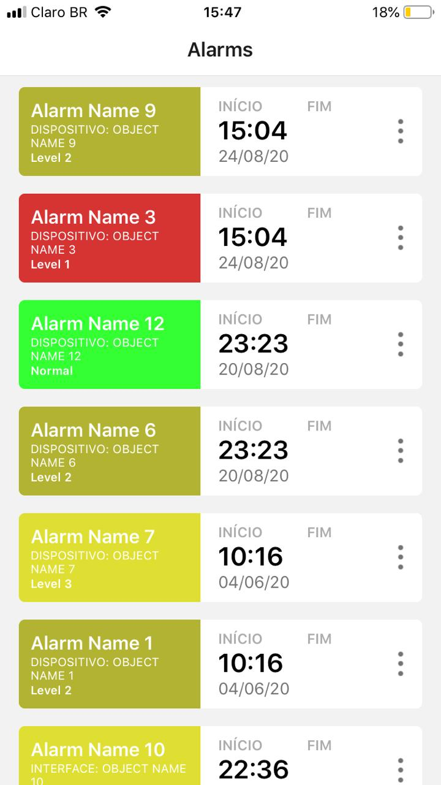
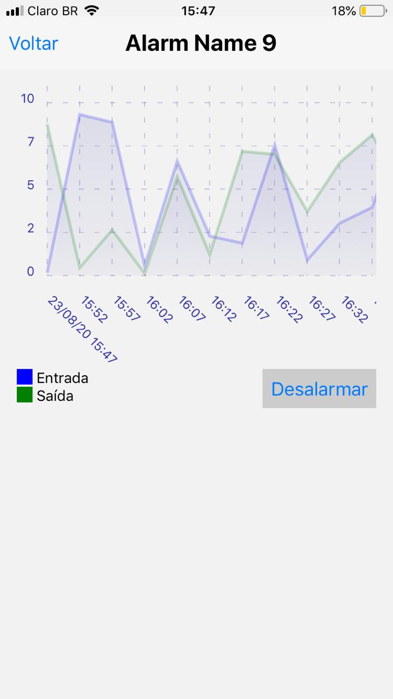

# alerts-test-telcomanager

## Sobre

Projeto desenvolvido como desafio no processo seletivo da Telcomanager, o app deve:
  - Apresentar uma lista de alarmes baseados nos dados fornecidos por uma API
  - Cada alarme deve ser clicável e quando pressionado deve direcionar para uma tela com detalhes sobre o alarme
  - A tela de detalhes deve apresentar os dados do alarme e um gráfico de entrada e saída de dados

## Tecnologias
  - Typescript
  - React Native
  - Expo
  - React Navigation
  - React Native Chart Kit
  - Axios

## Como executar
  - Clone o repositorio
    ```bash 
    git clone https://github.com/RodrigoKaos/alerts-test-telcomanager.git 
    ```
  - Acesse o diretório da aplicação
    ```bash
    cd alerts-test-telcomanager
    ```
  - Instale as dependências
    ```bash
    yarn install
    ```
  - Inicie a aplicação
    ```bash
    # para iniciar o server
    yarn start

    # para iniciar no emulador ou dispositivo android
    yarn android

    # para iniciar no emulador ou dispositivo ios
    yarn ios 
    ```
  - Layout da aplicação
  
    
    